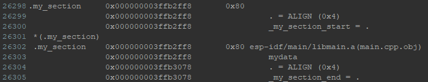

# CUSTOM LINKER SCRIPT

Para agregar un custom linker script se debe agregar un archivo que sea reconocido por el linker por lo tanto debe tener extension .ld o .lf
Este archivo se puede poner en cualquier parte del repositorio pero se debe tener en cuenta en cual de los CMakeLists.txt se lo va a definir.

En este repositorio el custom_linker.ld se definio dentro de la carpeta main/ y se agrego las lineas " target_link_libraries(${COMPONENT_LIB} "-T ${CMAKE_CURRENT_SOURCE_DIR}/custom_linker.ld") " dentro del archivo CMakeLists.txt que se encuentra en main.

El archivo asigna una seccion llamada "my_section" a la DRAM, mas especificamente a la memoria dram0_0_seg.

Para corroborar que se haya asignado correctamente la sección, podemos verificar en el archivo .map que se genera en la carpeta Build/ luego de compilar.

Se puede ver a continuación la sección de memoria localizada en el archivo .map



Para utilizar esta sección, se hizo un ejemplo en el archivo main.cpp como lo que sigue:

```c
#define MYSECTION_ATTR __attribute__((section(".my_section")))

MYSECTION_ATTR uint8_t mydata[128];

```

Luego este array mydata se lo puede utilizar como cualquier array, pero nos aseguramos que esta dentro de la seccion que nosotros declaramos.